# Merge-Hit-Weapons

  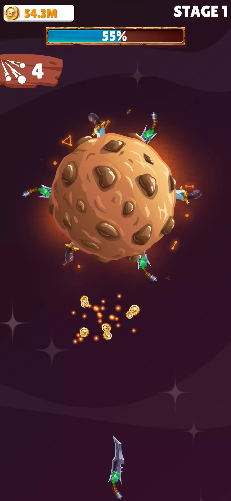
  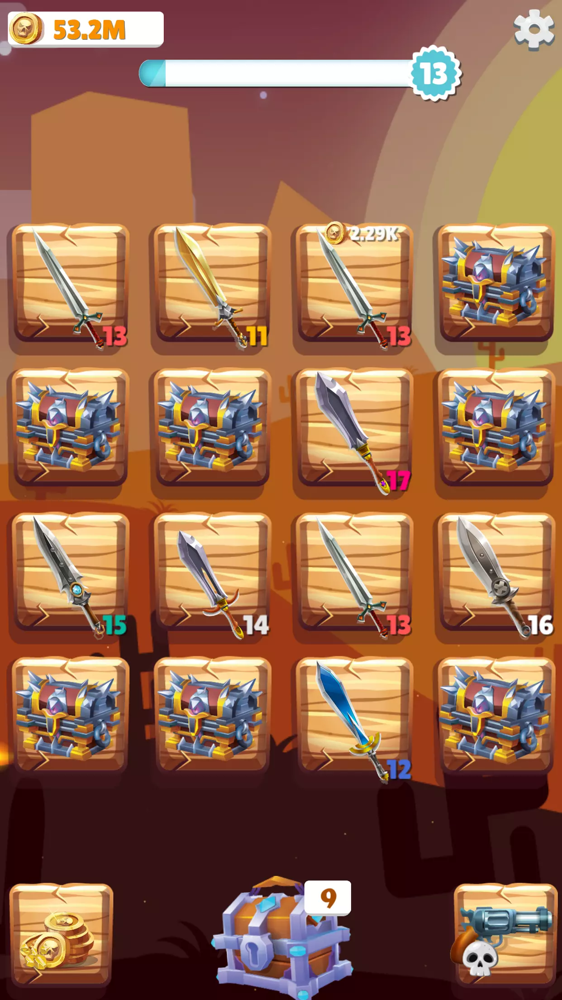
  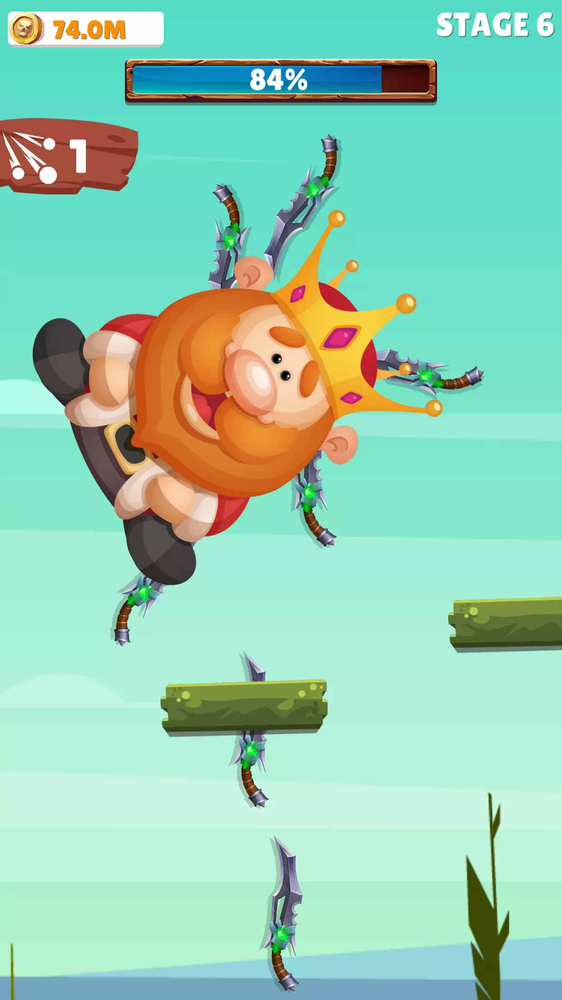
  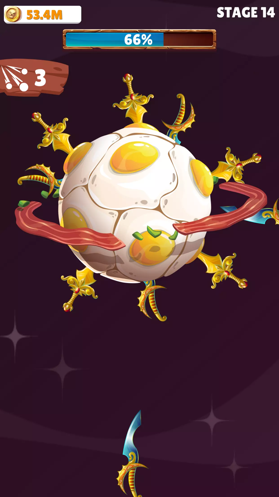
  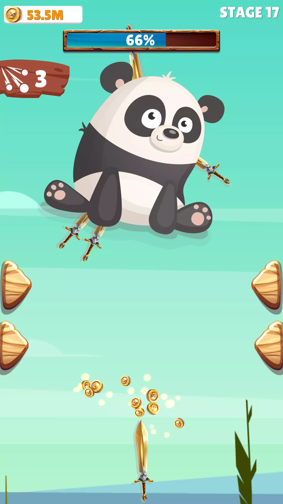
  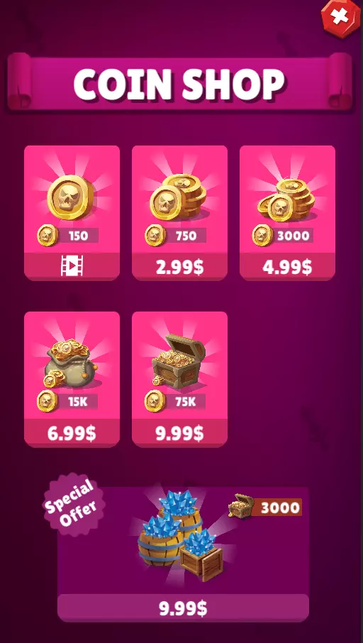
  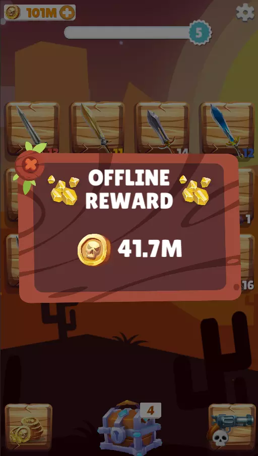
  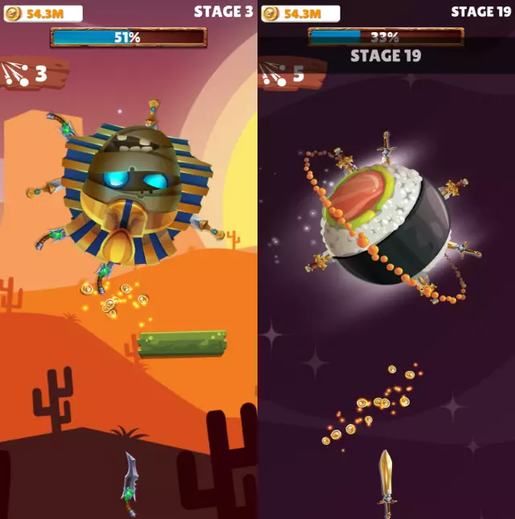
  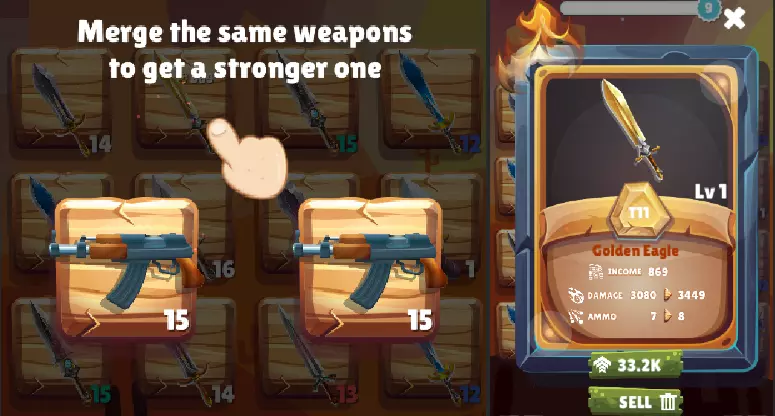
  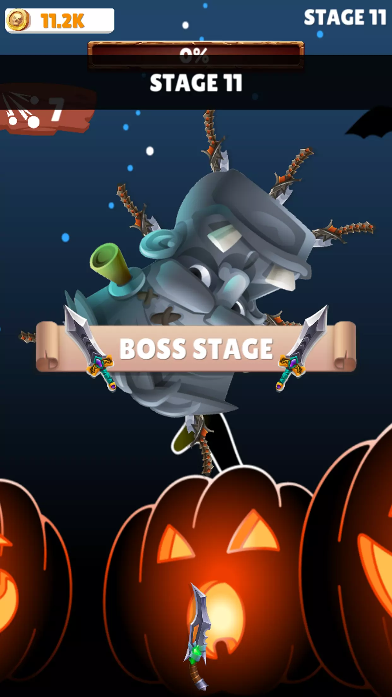
  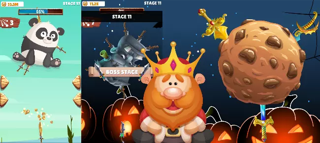

## FEATURES:
  * Popular merge gameplay
  * Knife Hit style level system
  * Offline reward system
  * Cute characters to shoot
  * In-App purchases – Buy coins in the shop
  * Detailed documentation attached about how to set up ads, configure analytics and IAP
  * Merge the knives, daggers and swords to make more and more powerful weapons to complete the upcoming levels.
  * Throw the weapons to the planets and bosses to damage them.
  * The game is originally mixing the merging gameplay with the Knife Hit gameplay creating a whole new experience.
  * Merge the weapons to create better ones. Upgraded weapons have more damage and income (every weapons produce coins in every 5 seconds)

## There are 2 upgrades:
  * Improved Weapons - increases the level of weapons from chests
  * Faster Chests - reduced the time of spawning chests

